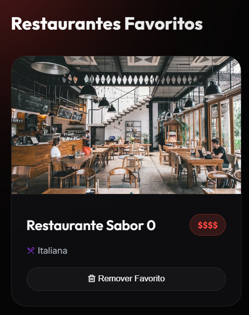
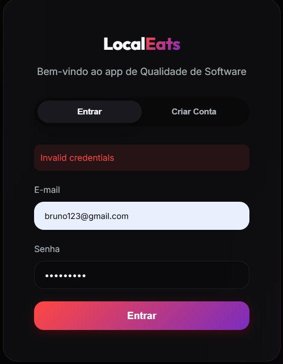

# Aula 6 – Planejamento e Execução de Testes

> Disciplina: Qualidade de Software  
> Projeto: LocalEats  
> Integrantes do grupo:  
> - Bruno Beiró Rehling

---

# 1. Plano de Testes

## 1.1 Objetivo
Descreva o objetivo do plano de testes.
> Validar as principais funcionalidades do sistema LocalEats, garantindo que atendam aos requisitos esperados e apresentem comportamento consistente.

---

## 1.2 Escopo

### O que será testado
- Cadastro e login de usuário
- Salvar e retirar de favoritos
- Analisar as recomendações do sistema
- Buscar restaurantes

### O que NÃO será testado
- Integração com sistemas externos, como pagamentos
- Navegadores antigos

---

## 1.3 Funcionalidades selecionadas
Liste as funcionalidades que serão foco dos testes:

- [Login/Cadastro]
- [Busca de restaurantes]
- [Salvar em favoritos]

---

## 1.4 Estratégia de Testes

Descreva como os testes serão realizados.

- Tipos de teste:
  - ( x ) Funcional
  - ( x ) Usabilidade
  - (   ) Outros: _______

- Abordagem:
  > Testes manuais baseados em cenários definidos previamente
  
---

## 1.5 Responsáveis

Defina os papéis na equipe:

| Nome | Responsabilidade |
|------|----------------|
| Bruno| Realizar todos os testes                |

---

# 2. Casos de Teste

Crie no mínimo 5 casos de teste.

---

## CT-01 – Login com sucesso

**Pré-condição:**  

O usuário deve ter uma conta cadastrada no sistema.

**Passos:**  

1.  Acessar tela de login
2.  Informar as informações solicitadas (email, senha)
3.  Clicar em entrar

**Dados de entrada (se aplicável):**  

Exemplo de login: Email -> bruno123@gmail.com, senha -> bruno123

**Resultado esperado:** 

O usuário acessa o sistema, com a sua conta logada.

---

## CT-02 – Salvar restaurante como favorito

**Pré-condição:**  

  O usuário deve estar logado no sistema.

**Passos:**  

1.  O usuário pesquisa ou seleciona um restaurante do feed
2.  O usuário seleciona a opção de favoritar o restaurante.

**Dados de entrada (se aplicável):**  

**Resultado esperado:**  

  O restaurante agora aparece na aba de favoritos do usuário.
---

## CT-03 – Recomendações personalizadas

**Pré-condição:**  

  O usuário deve estar logado e ter minimo 1 restaurante como favorito
**Passos:** 

1.  O usuário, após favoritar o restaurante desejado, sai do sistema
2.  O usuário retorna ao sistema e faz login
3.  O usuário acessa a página principal

**Dados de entrada (se aplicável):**  

  Restaurante Favoritado - restaurante sabor 0
**Resultado esperado:** 

  O sistema passa a recomendar restaurantes parecidos com os restaurante favoritos
---

## CT-04 – Login com senha incorreta

**Pré-condição:**  

  O usuário deve ter uma conta cadastrada no sistema
**Passos:**  

1.  O usuário acessa a tela de login
2.  O usuário insere o email correto
3.  O usuário insere a senha incorreta

**Dados de entrada (se aplicável):**  
  Exemplo de login: Email -> bruno123@gmail.com, senha -> bruno1234
**Resultado esperado:**  
  O sistema não realiza o login, e alerta o usuário sobre a senha ertar errada

---

## CT-05 – Recomendações não estão personalizadas

**Pré-condição:**  

  O usuário deve estar logado no sistema e deve ter pelo menos 1 restaurante favorito

**Passos:**  

1.  O usuário, após favoritar o restaurante desejado, sai do sistema
2.  O usuário retorna ao sistema e faz login
3.  O usuário acessa a página principal

**Dados de entrada (se aplicável):**  

  Restaurante Favoritado - restaurante sabor 0

**Resultado esperado:**  

  O sistema segue fazendo recomendações genéricas, mesmo após o usuário favoritar algum restaurante

---

# 3. Execução dos Testes

Preencha a tabela com os resultados obtidos.

| ID     | Resultado (Passou/Falhou) | Evidência (descrição ou print) |
|--------|--------------------------|--------------------------------|
| CT-01  |      Passou           |                                |
| CT-02  |       Passou                   |                                |
| CT-03  |     Falhou                     |  O sistema segue recomendando os mesmos restaurantes, mesmo após favoritar algum                              |
| CT-04  |         Passou                 |                                |
| CT-05  |       Passou                   |   O sistema segue mandando as mesmas recomendações genéricas mesmo após favoritar algum restaurante                             |

---

# 4. Análise dos Resultados

- Quantidade de testes executados:  5
- Quantidade de testes que passaram:  4
- Quantidade de testes que falharam:  1

## Principais problemas encontrados
- O sistema não possui a funcionalidade de recomendações personalisadas

---

# 5. Reflexão

Responda às questões abaixo:

- O plano de testes ajudou a organizar melhor o processo? Por quê?

  Sim, pois definiu o escopo do que deveria ser feito e as funcionalidades que seriam testadas.

- Algum problema só foi identificado durante a execução? Explique.

  Não encontrei nenhum problema durante a execução dos testes.
  Em relação as funcionalidades, todas exceto a recomendação personiladad para o usuario, que não está presente no sistema, algo importante nesse tipo de sistema.  

- O que o grupo melhoraria no processo de testes?
  Cração de testes automatizados
---

## Conclusão

O comportamento da funcionalidade não foi totalmente aceitável devido à função de recomendações personalizadas (CT-03). As demais funcionalidades testadas se comportaram conforme esperado.

---

# 6. Conclusão Geral

Faça um resumo final:

- Qualidade geral do sistema testado

  As funções básicas estão funcionando conforme o esperado, porém o sistema não possui recomendações personalisadas, o que é um praticamente um requisito implícito para esse tipo de sistema, isso faz o sistema ficar defasado em comparação com outros desse ramo. 

- Principais pontos positivos
  Login e tratamento de senha incorreta com mensagem de erro.
  O sistema permite favoritar restaurantes com sucesso.
  A busca retorna resultados relevantes.

- Principais problemas identificados

  O sistema não possui recomendações personalizadas para o usuário

- Impressão geral do grupo sobre o processo de testes

  O planejamento dos testes que foi trabalhado nesse PBL foi bastante proveitoso, pois deixou o processso mais longo, mas também mais organizado e documentado.
  O processo se mostrou bem eficaz e acho que deveria ser expandido para outras áreas do sistema.

