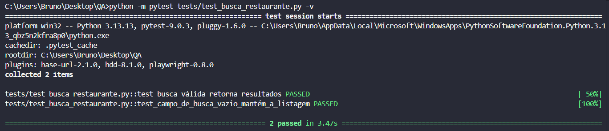
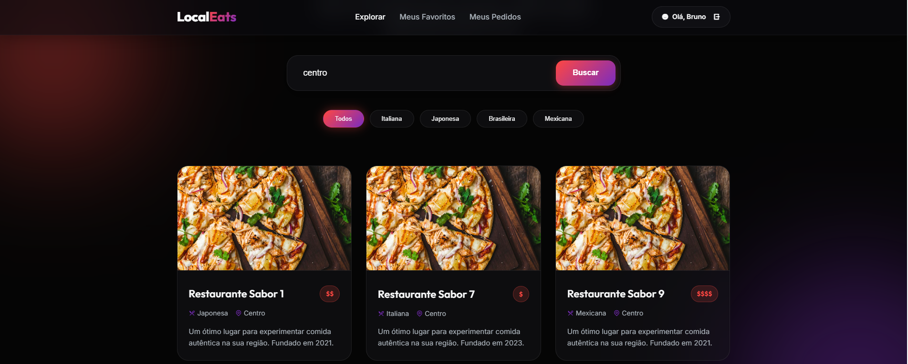

# Aula 12 – BDD e Automação Orientada a Comportamento
# Exemplo de Entrega PBL – LocalEats

## 👥 Integrantes

- Bruno Beiró Rehling

---

# 🔹 1. Fluxo escolhido

## Integrante: Bruno Beiró Rehling

### Fluxo
Busca de restaurantes 

### Objetivo
Validar se a busca retorna os resultados esperados.

---

# 🔹 2. Cenários BDD

## Arquivo

```text
features/historico_pedidos.feature
```

## Conteúdo

```gherkin
Feature: Busca de restaurantes

  Scenario: Busca válida retorna resultados
    Given que o usuário está na página inicial
    When busca por "centro"
    Then o sistema deve exibir a lista de restaurantes

  Scenario: Campo de busca vazio mantém a listagem
    Given que o usuário está na página inicial
    When não preenche o campo de busca
    Then o sistema deve exibir a lista de restaurantes
```

---

# 🔹 3. Automação com pytest-bdd

## Estrutura do projeto

```text
projeto/
│
├── features/
│   └── busca_restaurantes.feature
│
├── tests/
│   └── test_busca_restaurante.py
│
├── evidencias/
│
└── README.md
```

---

## Arquivo

```text
tests/test_busca_restaurante.py
```

## Código

```python
from pytest_bdd import scenarios, given, when, then

scenarios('../features/busca_restaurantes.feature')

BASE_URL = "https://local-eats-unisenac.vercel.app/static/login.html"

@given('que o usuário está na página inicial')
def acessar_pagina(page):
    page.goto(BASE_URL)
    page.get_by_role("textbox", name="teste@teste.com").fill("teste@teste.com")
    page.get_by_role("textbox", name="Sua senha secreta").fill("teste123")
    page.locator("#loginForm").get_by_role("button", name="Entrar").click()
    page.wait_for_selector("#restaurantGrid")

@when('busca por "centro"')
def buscar_restaurante(page):
    page.get_by_role("textbox", name="Buscar por culinária ou").fill("centro")
    page.get_by_role("button", name="Buscar").click()

@when('não preenche o campo de busca')
def nao_buscar(page):
    pass

@then('o sistema deve exibir a lista de restaurantes')
def validar_resultados(page):
    page.wait_for_selector("#restaurantGrid")
    assert page.locator("#restaurantGrid").is_visible()
```

---

# 🔹 4. Execução dos testes

## Comando executado

```bash
python -m pytest tests/test_busca_restaurante.py -v
```

---

## Resultado

```text
================================================================ test session starts ================================================================
platform win32 -- Python 3.13.13, pytest-9.0.3, pluggy-1.6.0 -- C:\Users\Bruno\AppData\Local\Microsoft\WindowsApps\PythonSoftwareFoundation.Python.3.13_qbz5n2kfra8p0\python.exe
cachedir: .pytest_cache
rootdir: C:\Users\Bruno\Desktop\QA
plugins: base-url-2.1.0, bdd-8.1.0, playwright-0.8.0
collected 2 items                                                                                                                                    

tests/test_busca_restaurante.py::test_busca_válida_retorna_resultados PASSED                                                                   [ 50%]
tests/test_busca_restaurante.py::test_campo_de_busca_vazio_mantém_a_listagem PASSED                                                            [100%]

================================================================= 2 passed in 3.47s =================================================================
```

---

# 🔹 5. Evidências

## Print da execução



## Print da aplicação



---

# 🔹 6. Análise crítica

## O cenário ficou legível?

Sim. A estrutura Given-When-Then ajudou a entender claramente o comportamento esperado.

---

## O BDD ajudou a entender o comportamento?

O BDD ajudou a separar o que o sistema deve fazer do como ele faz

---

## O teste ficou robusto?

Parcialmente. Os seletores dependem do ID do grid e do placeholder do campo de busca, se mudar quebrará o teste.

---

## Quais dificuldades surgiram?

- O teste rodava antes da página carregar após o login, causando erro
- Os steps do `.feature` precisam ser idênticos ao código, o que me gerou certa dor de cabeça pois eu não percebio que tinha colocado diferente
- Entender a integração entre pytest-bdd e Playwright levou algumas tentativas

---

## O teste ficou dependente da interface?

Sim. Mudanças no frontend podem quebrar alguns seletores.

---

# 🔹 7. Reflexão final

## BDD melhora comunicação entre equipe?

Sim. O comportamento do sistema ficou mais claro para QA, desenvolvimento e negócio.

---

## Todo teste deve usar BDD?

Não. BDD vale para fluxos de negócio importantes, não para testes técnicos simples.
---

## Quando vale a pena usar BDD?

Quando o comportamento do sistema precisa ser documentado de forma clara e colaborativa.

---

## Como isso ajuda no projeto do grupo?

Ajuda a transformar os requisitos do LocalEats em testes compreensíveis e organizados.

---

# 📦 Repositório GitHub

```text
https://github.com/brunorehling/projeto-qualidade-software
```

---

# ✅ Conclusão

O BDD mostrou que é possível descrever o comportamento do sistema de forma que qualquer pessoa entenda, sem precisar ler código. Apesar das dificuldades com o carregamento da página, o resultado foi um teste legível, organizado e funcional, que serve tanto como documentação quanto como validação automática do sistema.